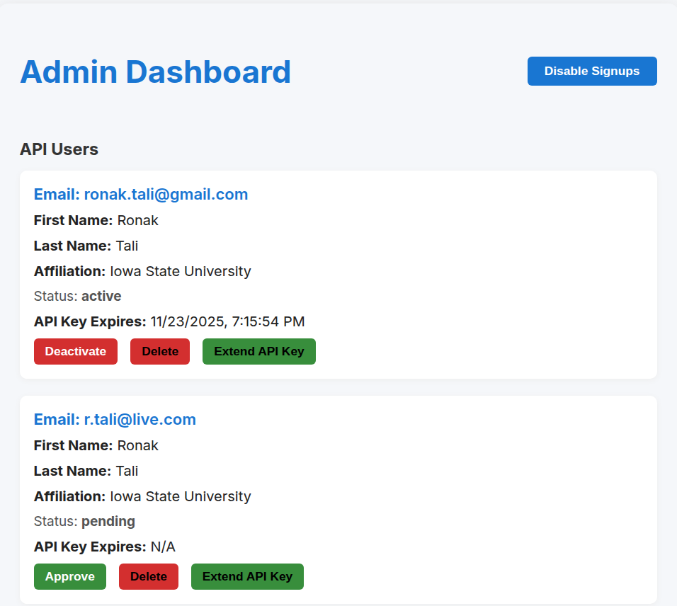

# SEARS API

This application provides the frontend and backend for SEARS. It has the following components:

- User/Admin authentication (signup/login)
  
- Admin dashboard for user management. Approve/Deactivate users
  
- User Dashboard for API key management, schema view, test queries
  
  


## Setup Instructions

1. Clone the repository:
   ```bash
   git clone https://github.com/yourusername/sears-api.git
   cd sears-api/backend (for frontend, use cd sears-api/frontend)
   ```

2. Install dependencies:
   ```bash
   npm install
   ```

3. Create a `.env` file from the example:
   ```bash
   cp .env.example .env
   ```

4. Update the `.env` file with your configuration.

5. Start the development server:
   ```bash
   npm run dev
   ```

Please Note:
```
You have to do it twice. once for the frontend and once for the backend.
```

